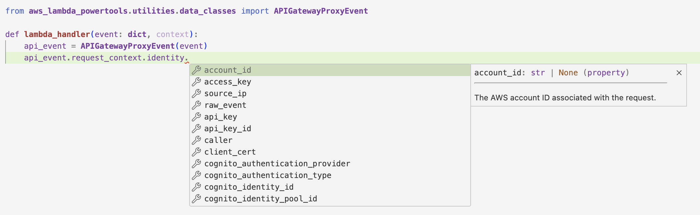

<!-- markdownlint-disable MD043 -->

Event Source Data Classes provides self-describing and strongly-typed classes for various AWS Lambda event sources.

## Key features

* Type hinting and code completion for common event types
* Helper functions for decoding/deserializing nested fields
* Docstrings for fields contained in event schemas
* Standardized attribute-based access to event properties

## Getting started

???+ tip
    All examples shared in this documentation are available within the [project repository](https://github.com/aws-powertools/powertools-lambda-python/tree/develop/examples){target="_blank"}.

There are two ways to use Event Source Data Classes in your Lambda functions.

**Method 1: Direct Initialization**

You can initialize the appropriate data class by passing the Lambda event object to its constructor.

=== "app.py"

    ```python hl_lines="1 4"
    --8<-- "examples/event_sources/src/getting_started_data_classes.py"
    ```

=== "API Gateway Proxy Example Event"

    ```json hl_lines="3-4"
    --8<-- "examples/event_sources/events/apigw_event.json"
    ```

**Method 2: Using the event_source Decorator**

Alternatively, you can use the `event_source` decorator to automatically parse the event.

=== "app.py"

    ```python hl_lines="1 4"
    --8<-- "examples/event_sources/src/apigw_proxy_decorator.py"
    ```

=== "API Gateway Proxy Example Event"

    ```json hl_lines="3-4"
    --8<-- "examples/event_sources/events/apigw_event.json"
    ```

### Autocomplete with self-documented properties and methods

Event Source Data Classes has the ability to leverage IDE autocompletion and inline documentation.
When using the APIGatewayProxyEvent class, for example, the IDE will offer autocomplete suggestions for various properties and methods.



## Supported event sources

Each event source is linked to its corresponding GitHub file with the full set of properties, methods, and docstrings specific to each event type.

| Event Source | Data_class | Properties |
|--------------|------------|------------|
| [Active MQ](#active-mq) | `ActiveMQEvent` | [Github](https://github.com/aws-powertools/powertools-lambda-python/blob/develop/aws_lambda_powertools/utilities/data_classes/active_mq_event.py) |
| [API Gateway Authorizer](#api-gateway-authorizer) | `APIGatewayAuthorizerRequestEvent` | [Github](https://github.com/aws-powertools/powertools-lambda-python/blob/develop/aws_lambda_powertools/utilities/data_classes/api_gateway_authorizer_event.py) |
| [API Gateway Authorizer V2](#api-gateway-authorizer-v2) | `APIGatewayAuthorizerEventV2` | [Github](https://github.com/aws-powertools/powertools-lambda-python/blob/develop/aws_lambda_powertools/utilities/data_classes/api_gateway_authorizer_event.py) |
| [API Gateway Proxy](#api-gateway-proxy) | `APIGatewayProxyEvent` | [Github](https://github.com/aws-powertools/powertools-lambda-python/blob/develop/aws_lambda_powertools/utilities/data_classes/api_gateway_proxy_event.py) |
| [API Gateway Proxy V2](#api-gateway-proxy-v2) | `APIGatewayProxyEventV2` | [Github](https://github.com/aws-powertools/powertools-lambda-python/blob/develop/aws_lambda_powertools/utilities/data_classes/api_gateway_proxy_event.py) |
| [Application Load Balancer](#application-load-balancer) | `ALBEvent` | [Github](https://github.com/aws-powertools/powertools-lambda-python/blob/develop/aws_lambda_powertools/utilities/data_classes/alb_event.py) |
| [AppSync Authorizer](#appsync-authorizer) | `AppSyncAuthorizerEvent` | [Github](https://github.com/aws-powertools/powertools-lambda-python/blob/develop/aws_lambda_powertools/utilities/data_classes/appsync_authorizer_event.py) |
| [AppSync Resolver](#appsync-resolver) | `AppSyncResolverEvent` | [Github](https://github.com/aws-powertools/powertools-lambda-python/blob/develop/aws_lambda_powertools/utilities/data_classes/appsync_resolver_event.py) |
| [AWS Config Rule](#aws-config-rule) | `AWSConfigRuleEvent` | [Github](https://github.com/aws-powertools/powertools-lambda-python/blob/develop/aws_lambda_powertools/utilities/data_classes/aws_config_rule_event.py) |
| [Bedrock Agent](#bedrock-agent) | `BedrockAgent` | [Github](https://github.com/aws-powertools/powertools-lambda-python/blob/develop/aws_lambda_powertools/utilities/data_classes/bedrock_agent_event.py) |
| [CloudFormation Custom Resource](#cloudformation-custom-resource) | `CloudFormationCustomResourceEvent` | [Github](https://github.com/aws-powertools/powertools-lambda-python/blob/develop/aws_lambda_powertools/utilities/data_classes/cloudformation_custom_resource_event.py) |
| [CloudWatch Alarm State Change Action](#cloudwatch-alarm-state-change-action) | `CloudWatchAlarmEvent` | [Github](https://github.com/aws-powertools/powertools-lambda-python/blob/develop/aws_lambda_powertools/utilities/data_classes/cloud_watch_alarm_event.py) |
| [CloudWatch Dashboard Custom Widget](#cloudwatch-dashboard-custom-widget) | `CloudWatchDashboardCustomWidgetEvent` | [Github](https://github.com/aws-powertools/powertools-lambda-python/blob/develop/aws_lambda_powertools/utilities/data_classes/cloud_watch_custom_widget_event.py) |
| [CloudWatch Logs](#cloudwatch-logs) | `CloudWatchLogsEvent` | [Github](https://github.com/aws-powertools/powertools-lambda-python/blob/develop/aws_lambda_powertools/utilities/data_classes/cloud_watch_logs_event.py) |
| [CodeDeploy Lifecycle Hook](#codedeploy-lifecycle-hook) | `CodeDeployLifecycleHookEvent` | [Github](https://github.com/aws-powertools/powertools-lambda-python/blob/develop/aws_lambda_powertools/utilities/data_classes/code_deploy_lifecycle_hook_event.py) |
| [CodePipeline Job Event](#codepipeline-job) | `CodePipelineJobEvent` | [Github](https://github.com/aws-powertools/powertools-lambda-python/blob/develop/aws_lambda_powertools/utilities/data_classes/code_pipeline_job_event.py) |
| [Cognito User Pool](#cognito-user-pool) | Multiple available under `cognito_user_pool_event` | [Github](https://github.com/aws-powertools/powertools-lambda-python/blob/develop/aws_lambda_powertools/utilities/data_classes/cognito_user_pool_event.py) |
| [Connect Contact Flow](#connect-contact-flow) | `ConnectContactFlowEvent` | [Github](https://github.com/aws-powertools/powertools-lambda-python/blob/develop/aws_lambda_powertools/utilities/data_classes/connect_contact_flow_event.py) |
| [DynamoDB streams](#dynamodb-streams) | `DynamoDBStreamEvent`, `DynamoDBRecordEventName` | [Github](https://github.com/aws-powertools/powertools-lambda-python/blob/develop/aws_lambda_powertools/utilities/data_classes/dynamo_db_stream_event.py) |
| [EventBridge](#eventbridge) | `EventBridgeEvent` | [Github](https://github.com/aws-powertools/powertools-lambda-python/blob/develop/aws_lambda_powertools/utilities/data_classes/event_bridge_event.py) |
| [Kafka](#kafka) | `KafkaEvent` | [Github](https://github.com/aws-powertools/powertools-lambda-python/blob/develop/aws_lambda_powertools/utilities/data_classes/kafka_event.py) |
| [Kinesis Data Stream](#kinesis-streams) | `KinesisStreamEvent` | [Github](https://github.com/aws-powertools/powertools-lambda-python/blob/develop/aws_lambda_powertools/utilities/data_classes/kinesis_stream_event.py) |
| [Kinesis Firehose Delivery Stream](#kinesis-firehose-delivery-stream) | `KinesisFirehoseEvent` | [Github](https://github.com/aws-powertools/powertools-lambda-python/blob/develop/aws_lambda_powertools/utilities/data_classes/kinesis_firehose_event.py) |
| [Lambda Function URL](#lambda-function-url) | `LambdaFunctionUrlEvent` | [Github](https://github.com/aws-powertools/powertools-lambda-python/blob/develop/aws_lambda_powertools/utilities/data_classes/lambda_function_url_event.py) |
| [Rabbit MQ](#rabbit-mq) | `RabbitMQEvent` | [Github](https://github.com/aws-powertools/powertools-lambda-python/blob/develop/aws_lambda_powertools/utilities/data_classes/rabbit_mq_event.py) |
| [S3](#s3) | `S3Event` | [Github](https://github.com/aws-powertools/powertools-lambda-python/blob/develop/aws_lambda_powertools/utilities/data_classes/s3_event.py) |
| [S3 Batch Operations](#s3-batch-operations) | `S3BatchOperationEvent` | [Github](https://github.com/aws-powertools/powertools-lambda-python/blob/develop/aws_lambda_powertools/utilities/data_classes/s3_batch_operation_event.py) |
| [S3 Object Lambda](#s3-object-lambda) | `S3ObjectLambdaEvent` | [Github](https://github.com/aws-powertools/powertools-lambda-python/blob/develop/aws_lambda_powertools/utilities/data_classes/s3_object_event.py) |
| [S3 EventBridge Notification](#s3-eventbridge-notification) | `S3EventBridgeNotificationEvent` | [Github](https://github.com/aws-powertools/powertools-lambda-python/blob/develop/aws_lambda_powertools/utilities/data_classes/s3_event.py) |
| [SES](#ses) | `SESEvent` | [Github](https://github.com/aws-powertools/powertools-lambda-python/blob/develop/aws_lambda_powertools/utilities/data_classes/ses_event.py) |
| [SNS](#sns) | `SNSEvent` | [Github](https://github.com/aws-powertools/powertools-lambda-python/blob/develop/aws_lambda_powertools/utilities/data_classes/sns_event.py) |
| [SQS](#sqs) | `SQSEvent` | [Github](https://github.com/aws-powertools/powertools-lambda-python/blob/develop/aws_lambda_powertools/utilities/data_classes/sqs_event.py) |
| [TransferFamilyAuthorizer]                                                    | `TransferFamilyAuthorizer`                         | [Github](https://github.com/aws-powertools/powertools-lambda-python/blob/develop/aws_lambda_powertools/utilities/data_classes/transfer_family_event.py) |
| [TransferFamilyAuthorizerResponse]                                            | `TransferFamilyAuthorizerResponse`                 | [Github](https://github.com/aws-powertools/powertools-lambda-python/blob/develop/aws_lambda_powertools/utilities/data_classes/transfer_family_event.py) |
| [VPC Lattice V2](#vpc-lattice-v2) | `VPCLatticeV2Event` | [Github](https://github.com/aws-powertools/powertools-lambda-python/blob/develop/aws_lambda_powertools/utilities/data_classes/vpc_lattice.py) |
| [VPC Lattice V1](#vpc-lattice-v1) | `VPCLatticeEvent` | [Github](https://github.com/aws-powertools/powertools-lambda-python/blob/develop/aws_lambda_powertools/utilities/data_classes/vpc_lattice.py) |

???+ info
    The examples showcase a subset of Event Source Data Classes capabilities - for comprehensive details, leverage your IDE's
    autocompletion, refer to type hints and docstrings, and explore the [full API reference](https://docs.powertools.aws.dev/lambda/python/latest/api/utilities/data_classes/) for complete property listings of each event source.

### Active MQ

It is used for [Active MQ payloads](https://docs.aws.amazon.com/lambda/latest/dg/with-mq.html){target="_blank"}, also see
the [AWS blog post](https://aws.amazon.com/blogs/compute/using-amazon-mq-as-an-event-source-for-aws-lambda/){target="_blank"}
for more details.

=== "app.py"

    ```python hl_lines="5 10"
    --8<-- "examples/event_sources/src/active_mq_example.py"
    ```

=== "Active MQ Example Event"

    ```json hl_lines="6 9 18 21"
    --8<-- "tests/events/activeMQEvent.json"
    ```

### API Gateway Authorizer

It is used for [API Gateway Rest API Lambda Authorizer payload](https://docs.aws.amazon.com/apigateway/latest/developerguide/apigateway-use-lambda-authorizer.html){target="_blank"}.

Use **`APIGatewayAuthorizerRequestEvent`** for type `REQUEST` and **`APIGatewayAuthorizerTokenEvent`** for type `TOKEN`.

=== "app.py"

    ```python hl_lines="2-4 8"
    --8<-- "examples/event_sources/src/apigw_authorizer_request.py"
    ```

=== "API Gateway Authorizer Request Example Event"

    ```json hl_lines="3 11"
    --8<-- "tests/events/apiGatewayAuthorizerRequestEvent.json"
    ```

=== "app_token.py"

    ```python hl_lines="2-4 8"
    --8<-- "examples/event_sources/src/apigw_authorizer_token.py"
    ```

=== "API Gateway Authorizer Token Example Event"

    ```json hl_lines="2 3"
    --8<-- "tests/events/apiGatewayAuthorizerTokenEvent.json"
    ```

### API Gateway Authorizer V2

It is used for [API Gateway HTTP API Lambda Authorizer payload version 2](https://docs.aws.amazon.com/apigateway/latest/developerguide/http-api-lambda-authorizer.html){target="_blank"}.
See also [this blog post](https://aws.amazon.com/blogs/compute/introducing-iam-and-lambda-authorizers-for-amazon-api-gateway-http-apis/){target="_blank"} for more details.

=== "app.py"

    ```python hl_lines="4-6 16"
    --8<-- "examples/event_sources/src/apigw_auth_v2.py"
    ```

=== "API Gateway Authorizer V2 Example Event"

    ```json
    --8<-- "tests/events/apiGatewayAuthorizerV2Event.json"
    ```

### API Gateway Proxy

It is used for either API Gateway REST API or HTTP API using v1 proxy event.

=== "app.py"

    ```python hl_lines="1 4"
    --8<-- "examples/event_sources/src/apigw_proxy_decorator.py"
    ```

=== "API Gateway Proxy Example Event"

    ```json hl_lines="3 4"
    --8<-- "examples/event_sources/events/apigw_event.json"
    ```

### API Gateway Proxy V2

It is used for HTTP API using v2 proxy event.

=== "app.py"

    ```python hl_lines="1 4"
    --8<-- "examples/event_sources/src/apigw_proxy_v2.py"
    ```

=== "API Gateway Proxy V2 Example Event"

    ```json
    --8<-- "tests/events/apiGatewayProxyV2Event.json"
    ```

### Application Load Balancer

Is it used for [Application load balancer](https://docs.aws.amazon.com/elasticloadbalancing/latest/application/introduction.html) event.

=== "app.py"

    ```python hl_lines="1 4"
    --8<-- "examples/event_sources/src/albEvent.py"
    ```

=== "Application Load Balancer Example Event"

    ```json hl_lines="7 8"
    --8<-- "tests/events/albEvent.json"
    ```

### AppSync Authorizer

Used when building an [AWS_LAMBDA Authorization](https://docs.aws.amazon.com/appsync/latest/devguide/security-authz.html#aws-lambda-authorization){target="_blank"} with AppSync.
See blog post [Introducing Lambda authorization for AWS AppSync GraphQL APIs](https://aws.amazon.com/blogs/mobile/appsync-lambda-auth/){target="_blank"}
or read the Amplify documentation on using [AWS Lambda for authorization](https://docs.amplify.aws/lib/graphqlapi/authz/q/platform/js#aws-lambda){target="_blank"} with AppSync.

=== "app.py"

    ```python hl_lines="5-7 20"
    --8<-- "examples/event_sources/src/appSyncAuthorizer.py"
    ```

=== "AppSync Authorizer Example Event"

    ```json
    --8<-- "tests/events/appSyncAuthorizerEvent.json"
    ```

### AppSync Resolver

Used when building Lambda GraphQL Resolvers with [Amplify GraphQL Transform Library](https://docs.amplify.aws/cli/graphql-transformer/function){target="_blank"} (`@function`),
and [AppSync Direct Lambda Resolvers](https://aws.amazon.com/blogs/mobile/appsync-direct-lambda/){target="_blank"}.

The example serves as an AppSync resolver for the `locations` field of the `Merchant` type. It uses the `@event_source` decorator to parse the AppSync event, handles pagination and filtering for locations, and demonstrates `AppSyncIdentityCognito`.

=== "app.py"

    ```python hl_lines="2-4 9"
    --8<-- "examples/event_sources/src/appSyncResolver.py"
    ```

=== "AppSync Resolver Example Event"

    ```json
    --8<-- "tests/events/appSyncResolverEvent.json"
    ```

### AWS Config Rule

The example utilizes AWSConfigRuleEvent to parse the incoming event. The function logs the message type of the invoking event and returns a simple success response. The example event receives a Scheduled Event Notification, but could also be ItemChanged and Oversized.

=== "app.py"
    ```python hl_lines="2-3 10"
    --8<-- "examples/event_sources/src/aws_config_rule.py"
    ```

=== "ScheduledNotification Example Event"
    ```json
    --8<-- "tests/events/awsConfigRuleScheduled.json"
    ```

### Bedrock Agent

The example handles [Bedrock Agent event](https://aws.amazon.com/bedrock/agents/) with `BedrockAgentEvent` to parse the incoming event. The function logs the action group and input text, then returns a structured response compatible with Bedrock Agent's expected format, including a mock response body.

=== "app.py"

    ```python hl_lines="2 7"
    --8<-- "examples/event_sources/src/bedrock_agent.py"
    ```

=== "Bedrock Agent Example Event"
    ```json
    --8<-- "tests/events/bedrockAgentEvent.json"
    ```

### CloudFormation Custom Resource

The example focuses on the `Create` request type, generating a unique physical resource ID and logging the process. The function is structured to potentially handle `Update` and `Delete` operations as well.

=== "app.py"

    ```python hl_lines="2-3 11 15 21"
    --8<-- "examples/event_sources/src/cloudformation_custom_resource_handler.py"
    ```

=== "CloudFormation Custom Resource Example Event"
    ```json
    --8<-- "tests/events/cloudformationCustomResourceCreate.json"
    ```

### CloudWatch Dashboard Custom Widget

Thie example for `CloudWatchDashboardCustomWidgetEvent` logs the dashboard name, extracts key information like widget ID and time range, and returns a formatted response with a title and markdown content. Read more about [custom widgets for Cloudwatch dashboard](https://docs.aws.amazon.com/AmazonCloudWatch/latest/monitoring/add_custom_widget_samples.html).

=== "app.py"

    ```python hl_lines="2 7"
    --8<-- "examples/event_sources/src/cloudWatchDashboard.py"
    ```

=== "CloudWatch Dashboard Example Event"
    ```json
    --8<-- "tests/events/cloudWatchDashboardEvent.json"
    ```

### CloudWatch Alarm State Change Action

[CloudWatch supports Lambda as an alarm state change action](https://docs.aws.amazon.com/AmazonCloudWatch/latest/monitoring/AlarmThatSendsEmail.html#alarms-and-actions){target="_blank"}.
You can use the `CloudWathAlarmEvent` data class to access the fields containing such data as alarm information, current state, and previous state.

=== "app.py"

    ```python hl_lines="2 8"
    --8<-- "examples/event_sources/src/cloudwatch_alarm_event.py"
    ```

=== "CloudWatch Alarm Example Event"
    ```json
    --8<-- "tests/events/cloudWatchAlarmEventSingleMetric.json"
    ```

### CloudWatch Logs

CloudWatch Logs events by default are compressed and base64 encoded. You can use the helper function provided to decode,
decompress and parse json data from the event.

=== "app.py"

    ```python hl_lines="2-3 8"
    --8<-- "examples/event_sources/src/cloudwatch_logs.py"
    ```

=== "CloudWatch Logs Example Event"
    ```json
    --8<-- "tests/events/cloudWatchLogEvent.json"
    ```

#### Kinesis integration

[When streaming CloudWatch Logs to a Kinesis Data Stream](https://aws.amazon.com/premiumsupport/knowledge-center/streaming-cloudwatch-logs/){target="_blank"} (cross-account or not), you can use `extract_cloudwatch_logs_from_event` to decode, decompress and extract logs as `CloudWatchLogsDecodedData` to ease log processing.

=== "app.py"

    ```python hl_lines="5-7 11"
    --8<-- "examples/event_sources/src/kinesisStreamCloudWatchLogs.py"
    ```

=== "Kinesis Stream CloudWatch Logs Example Event"
    ```json
    --8<-- "tests/events/kinesisStreamCloudWatchLogsEvent.json"
    ```

Alternatively, you can use `extract_cloudwatch_logs_from_record` to seamless integrate with the [Batch utility](./batch.md){target="_blank"} for more robust log processing.

=== "app.py"

    ```python hl_lines="7-9 18"
    --8<-- "examples/event_sources/src/kinesis_batch_example.py"
    ```

=== "Kinesis Stream CloudWatch Logs Example Event"
    ```json
    --8<-- "tests/events/kinesisStreamCloudWatchLogsEvent.json"
    ```

### CodeDeploy LifeCycle Hook

CodeDeploy triggers Lambdas with this event when defined in
[AppSpec definitions](https://docs.aws.amazon.com/codedeploy/latest/userguide/reference-appspec-file-structure-hooks.html)
to test applications at different stages of deployment.

=== "app.py"

    ```python hl_lines="1 4"
    --8<-- "examples/event_sources/src/codedeploy_lifecycle_hook.py"
    ```

=== "CodeDeploy LifeCycle Hook Example Event"
    ```json
    --8<-- "tests/events/codeDeployLifecycleHookEvent.json"
    ```

### CodePipeline Job

Data classes and utility functions to help create continuous delivery pipelines tasks with AWS Lambda.

=== "app.py"
    ```python hl_lines="1 4"
    --8<-- "examples/event_sources/src/code_pipeline_job.py"
    ```
=== "CodePipeline Job Example Event"
    ```json hl_lines="3 19"
    --8<-- "tests/events/codePipelineEvent.json"
    ```

### Cognito User Pool

Cognito User Pools have several [different Lambda trigger sources](https://docs.aws.amazon.com/cognito/latest/developerguide/cognito-user-identity-pools-working-with-aws-lambda-triggers.html#cognito-user-identity-pools-working-with-aws-lambda-trigger-sources){target="_blank"}, all of which map to a different data class, which
can be imported from `aws_lambda_powertools.data_classes.cognito_user_pool_event`:

| Trigger/Event Source    | Data Class                                                                     |
| ---------------------   | ------------------------------------------------------------------------------ |
| Custom message event    | `data_classes.cognito_user_pool_event.CustomMessageTriggerEvent`               |
| Post authentication     | `data_classes.cognito_user_pool_event.PostAuthenticationTriggerEvent`          |
| Post confirmation       | `data_classes.cognito_user_pool_event.PostConfirmationTriggerEvent`            |
| Pre authentication      | `data_classes.cognito_user_pool_event.PreAuthenticationTriggerEvent`           |
| Pre sign-up             | `data_classes.cognito_user_pool_event.PreSignUpTriggerEvent`                   |
| Pre token generation    | `data_classes.cognito_user_pool_event.PreTokenGenerationTriggerEvent`          |
| Pre token generation V2 | `data_classes.cognito_user_pool_event.PreTokenGenerationV2TriggerEvent`        |
| User migration          | `data_classes.cognito_user_pool_event.UserMigrationTriggerEvent`               |
| Define Auth Challenge   | `data_classes.cognito_user_pool_event.DefineAuthChallengeTriggerEvent`         |
| Create Auth Challenge   | `data_classes.cognito_user_pool_event.CreateAuthChallengeTriggerEvent`         |
| Verify Auth Challenge   | `data_classes.cognito_user_pool_event.VerifyAuthChallengeResponseTriggerEvent` |
| Custom Email Sender     | `data_classes.cognito_user_pool_event.CustomEmailSenderTriggerEvent`           |
| Custom SMS Sender       | `data_classes.cognito_user_pool_event.CustomSMSSenderTriggerEvent`             |

Some examples for the Cognito User Pools Lambda triggers sources:

#### Post Confirmation Example

=== "app.py"

    ```python hl_lines="1 5"
    --8<-- "examples/event_sources/src/cognito_post_confirmation.py"
    ```

=== "Cognito Post Confirmation Example Event"
    ```json hl_lines="12-14"
    --8<-- "tests/events/cognitoPostConfirmationEvent.json"
    ```

#### Define Auth Challenge Example

???+ note
    In this example we are modifying the wrapped dict response fields, so we need to return the json serializable wrapped event in `event.raw_event`.

This example is based on the AWS Cognito docs for [Define Auth Challenge Lambda Trigger](https://docs.aws.amazon.com/cognito/latest/developerguide/user-pool-lambda-define-auth-challenge.html){target="_blank"}.

=== "app.py"

    ```python hl_lines="1 5"
    --8<-- "examples/event_sources/src/cognito_define_auth.py"
    ```

=== "Cognito Define Auth Challengen Example Event"
    ```json
    --8<-- "tests/events/cognitoDefineAuthChallengeEvent.json"
    ```

#### Create Auth Challenge Example

This example is based on the AWS Cognito docs for [Create Auth Challenge Lambda Trigger](https://docs.aws.amazon.com/cognito/latest/developerguide/user-pool-lambda-create-auth-challenge.html){target="_blank"}.

=== "app.py"

    ```python hl_lines="2 5"
    --8<-- "examples/event_sources/src/cognito_create_auth.py"
    ```

=== "Cognito Create Auth Challengen Example Event"
    ```json
    --8<-- "tests/events/cognitoCreateAuthChallengeEvent.json"
    ```

#### Verify Auth Challenge Response Example

This example is based on the AWS Cognito docs for [Verify Auth Challenge Response Lambda Trigger](https://docs.aws.amazon.com/cognito/latest/developerguide/user-pool-lambda-verify-auth-challenge-response.html){target="_blank"}.

=== "app.py"

    ```python hl_lines="2 5"
    --8<-- "examples/event_sources/src/cognito_verify_auth.py"
    ```

=== "Cognito Verify Auth Challengen Example Event"
    ```json
    --8<-- "tests/events/cognitoVerifyAuthChallengeResponseEvent.json"
    ```

### Connect Contact Flow

The example integrates with [Amazon Connect](https://docs.aws.amazon.com/connect/latest/adminguide/what-is-amazon-connect.html) by handling contact flow events. The function converts the event into a `ConnectContactFlowEvent` object, providing a structured representation of the contact flow data.

=== "app.py"

    ```python hl_lines="1-5 10"
    --8<-- "examples/event_sources/src/connect_contact_flow.py"
    ```

=== "Connect Contact Flow Example Event"
    ```json
    --8<-- "tests/events/connectContactFlowEventAll.json"
    ```

### DynamoDB Streams

The DynamoDB data class utility provides the base class for `DynamoDBStreamEvent`, as well as enums for stream view type (`StreamViewType`) and event type.
(`DynamoDBRecordEventName`).
The class automatically deserializes DynamoDB types into their equivalent Python types.

=== "app.py"
    ```python hl_lines="1-3 8"
    --8<-- "examples/event_sources/src/dynamodb_stream.py"
    ```
=== "app_multiple_records.py"
    ```python hl_lines="1 5"
    --8<-- "examples/event_sources/src/dynamodb_multiple_records.py"
    ```
=== "DynamoDB Streams Example Event"
    ```json
    --8<-- "tests/events/dynamoStreamEvent.json"
    ```

### EventBridge

 When an event matching a defined rule occurs in EventBridge, it can [automatically trigger a Lambda function](https://docs.aws.amazon.com/lambda/latest/dg/with-eventbridge-scheduler.html), passing the event data as input.

=== "app.py"

    ```python hl_lines="1 4"
    --8<-- "examples/event_sources/src/eventBridgeEvent.py"
    ```

=== "EventBridge Example Event"
    ```json
    --8<-- "tests/events/eventBridgeEvent.json"
    ```

### Kafka

This example is based on the AWS docs for [Amazon MSK](https://docs.aws.amazon.com/lambda/latest/dg/with-msk.html){target="_blank"} and [self-managed Apache Kafka](https://docs.aws.amazon.com/lambda/latest/dg/with-kafka.html){target="_blank"}.

=== "app.py"

    ```python hl_lines="1 8"
    --8<-- "examples/event_sources/src/kafka_event.py"
    ```

=== "Kafka Example Event"
    ```json
    --8<-- "tests/events/kafkaEventMsk.json"
    ```

### Kinesis streams

Kinesis events by default contain base64 encoded data. You can use the helper function to access the data either as json
or plain text, depending on the original payload.

=== "app.py"

    ```python hl_lines="4 11"
    --8<-- "examples/event_sources/src/kinesis_streams.py"
    ```

=== "Kinesis streams Example Event"
    ```json
    --8<-- "tests/events/kinesisStreamEvent.json"
    ```

### Kinesis Firehose delivery stream

When using Kinesis Firehose, you can use a Lambda function to [perform data transformation](https://docs.aws.amazon.com/firehose/latest/dev/data-transformation.html){target="_blank"}. For each transformed record, you can choose to either:

* **A)** Put them back to the delivery stream (default)
* **B)** Drop them so consumers don't receive them (e.g., data validation)
* **C)** Indicate a record failed data transformation and should be retried

To do that, you can use `KinesisFirehoseDataTransformationResponse` class along with helper functions to make it easier to decode and encode base64 data in the stream.

=== "Transforming streaming records"

    ```python hl_lines="2-3 10 12"
    --8<-- "examples/event_sources/src/kinesis_firehose_delivery_stream.py"
    ```

    1. **Ingesting JSON payloads?** <br><br> Use `record.data_as_json` to easily deserialize them.
    2. For your convenience, `base64_from_json` serializes a dict to JSON, then encode as base64 data.

=== "Dropping invalid records"

    ```python hl_lines="5-6 14 16"
    --8<-- "examples/event_sources/src/kinesis_firehose_response_drop.py"
    ```

    1. This exception would be generated from `record.data_as_json` if invalid payload.

=== "Indicating a processing failure"

    ```python hl_lines="2-3 11 33"
    --8<-- "examples/event_sources/src/kinesis_firehose_response_exception.py"
    ```

    1. This record will now be sent to your [S3 bucket in the `processing-failed` folder](https://docs.aws.amazon.com/firehose/latest/dev/data-transformation.html#data-transformation-failure-handling){target="_blank"}.

=== "kinesisFirehoseEvent.json"
    ```json
    --8<-- "tests/events/kinesisFirehoseKinesisEvent.json"
    ```

### Lambda Function URL

[Lambda Function URLs](https://docs.aws.amazon.com/lambda/latest/dg/urls-invocation.html) provide a direct HTTP endpoint for invoking Lambda functions. This feature allows functions to receive and process HTTP requests without the need for additional services like API Gateway.

=== "app.py"

    ```python hl_lines="1 4"
    --8<-- "examples/event_sources/src/lambdaFunctionUrl.py"
    ```

=== "Lambda Function URL Example Event"
    ```json
    --8<-- "tests/events/lambdaFunctionUrlEvent.json"
    ```

### Rabbit MQ

It is used for [Rabbit MQ payloads](https://docs.aws.amazon.com/lambda/latest/dg/with-mq.html){target="_blank"}. See
the [blog post](https://aws.amazon.com/blogs/compute/using-amazon-mq-for-rabbitmq-as-an-event-source-for-lambda/){target="_blank"}
for more details.

=== "app.py"

    ```python hl_lines="5 10"
    --8<-- "examples/event_sources/src/rabbit_mq_example.py"
    ```

=== "Rabbit MQ Example Event"
    ```json
    --8<-- "tests/events/rabbitMQEvent.json"
    ```

### S3

Integration with Amazon S3 enables automatic, serverless processing of object-level events in S3 buckets. When triggered by actions like object creation or deletion, Lambda functions receive detailed event information, allowing for real-time file processing, data transformations, and automated workflows.

=== "app.py"

    ```python hl_lines="3 6"
    --8<-- "examples/event_sources/src/s3Event.py"
    ```

=== "S3 Example Event"
    ```json
    --8<-- "tests/events/s3Event.json"
    ```

### S3 Batch Operations

This example is based on the AWS S3 Batch Operations documentation [Example Lambda function for S3 Batch Operations](https://docs.aws.amazon.com/AmazonS3/latest/userguide/batch-ops-invoke-lambda.html){target="_blank"}.

=== "app.py"

    ```python hl_lines="4 8 10 20 25 27 29 33"
    --8<-- "examples/event_sources/src/s3_batch_operation.py"
    ```

=== "S3 Batch Operations Example Event"

    ```json
    --8<-- "tests/events/s3BatchOperationEventSchemaV2.json"
    ```

### S3 Object Lambda

This example is based on the AWS Blog post [Introducing Amazon S3 Object Lambda – Use Your Code to Process Data as It Is Being Retrieved from S3](https://aws.amazon.com/blogs/aws/introducing-amazon-s3-object-lambda-use-your-code-to-process-data-as-it-is-being-retrieved-from-s3/){target="_blank"}.

=== "app.py"

    ```python hl_lines="5 6 13 15"
    --8<-- "examples/event_sources/src/s3_object_lambda.py"
    ```

=== "S3 Object Lambda Example Event"

    ```json
    --8<-- "examples/event_sources/events/s3ObjectEvent.json"
    ```

### S3 EventBridge Notification

[S3 EventBridge notifications](https://docs.aws.amazon.com/AmazonS3/latest/userguide/EventBridge.html) enhance Lambda's ability to process S3 events by routing them through Amazon EventBridge. This integration offers advanced filtering, multiple destination support, and standardized CloudEvents format.

=== "app.py"

    ```python hl_lines="1 4"
    --8<-- "examples/event_sources/src/s3_event_bridge.py"
    ```

=== "S3 EventBridge Notification Example Event"

    ```json
    --8<-- "tests/events/s3EventBridgeNotificationObjectCreatedEvent.json"
    ```

### Secrets Manager

AWS Secrets Manager rotation uses an AWS Lambda function to update the secret. [Click here](https://docs.aws.amazon.com/secretsmanager/latest/userguide/rotating-secrets.html){target="_blank"} for more information about rotating AWS Secrets Manager secrets.

=== "app.py"

    ```python hl_lines="2 7 11"
    --8<-- "examples/event_sources/src/secrets_manager.py"
    ```

=== "Secrets Manager Example Event"

    ```json
    --8<-- "tests/events/secretsManagerEvent.json"
    ```

### SES

The integration with Simple Email Service (SES) enables serverless email processing. When configured, SES can trigger Lambda functions in response to incoming emails or delivery status notifications. The Lambda function receives an SES event containing details like sender, recipients, and email content.

=== "app.py"

    ```python hl_lines="1 4"
    --8<-- "examples/event_sources/src/ses_event.py"
    ```

=== "SES Example Event"

    ```json
    --8<-- "tests/events/sesEvent.json"
    ```

### SNS

The integration with Simple Notification Service (SNS) enables serverless message processing. When configured, SNS can trigger Lambda functions in response to published messages or notifications. The Lambda function receives an SNS event containing details like the message body, subject, and metadata.

=== "app.py"

    ```python hl_lines="1 4"
    --8<-- "examples/event_sources/src/sns_event.py"
    ```

=== "SNS Example Event"

    ```json
    --8<-- "tests/events/snsEvent.json"
    ```

### SQS

The integration with Simple Queue Service (SQS) enables serverless queue processing. When configured, SQS can trigger Lambda functions in response to messages in the queue. The Lambda function receives an SQS event containing details like message body, attributes, and metadata.

=== "app.py"

    ```python hl_lines="1 4"
    --8<-- "examples/event_sources/src/sqs_event.py"
    ```

=== "SQS Example Event"

    ```json
    --8<-- "tests/events/sqsEvent.json"
    ```

### VPC Lattice V2

You can register your Lambda functions as targets within an Amazon VPC Lattice service network. By doing this, your Lambda function becomes a service within the network, and clients that have access to the VPC Lattice service network can call your service using [Payload V2](https://docs.aws.amazon.com/lambda/latest/dg/services-vpc-lattice.html#vpc-lattice-receiving-events){target="_blank"}.

[Click here](https://docs.aws.amazon.com/lambda/latest/dg/services-vpc-lattice.html){target="_blank"} for more information about using AWS Lambda with Amazon VPC Lattice.

=== "app.py"

    ```python hl_lines="2 8"
    --8<-- "examples/event_sources/src/vpc_lattice_v2.py"
    ```

=== "Lattice Example Event"

    ```json
    --8<-- "examples/event_sources/events/vpc_lattice_v2_payload.json"
    ```

### VPC Lattice V1

You can register your Lambda functions as targets within an Amazon VPC Lattice service network. By doing this, your Lambda function becomes a service within the network, and clients that have access to the VPC Lattice service network can call your service.

[Click here](https://docs.aws.amazon.com/lambda/latest/dg/services-vpc-lattice.html){target="_blank"} for more information about using AWS Lambda with Amazon VPC Lattice.

=== "app.py"

    ```python hl_lines="2 8"
    --8<-- "examples/event_sources/src/vpc_lattice.py"
    ```

=== "Lattice Example Event"

    ```json
    --8<-- "examples/event_sources/events/vpc_lattice_payload.json"
    ```

## Advanced

### Debugging

Alternatively, you can print out the fields to obtain more information. All classes come with a `__str__` method that generates a dictionary string which can be quite useful for debugging.

However, certain events may contain sensitive fields such as `secret_access_key` and `session_token`, which are labeled as `[SENSITIVE]` to prevent any accidental disclosure of confidential information.

!!! warning "If we fail to deserialize a field value (e.g., JSON), they will appear as `[Cannot be deserialized]`"

=== "debugging.py"
    ```python hl_lines="9"
    --8<-- "examples/event_sources/src/debugging.py"
    ```

=== "debugging_event.json"
    ```json hl_lines="28 29"
    --8<-- "examples/event_sources/events/debugging_event.json"
    ```
=== "debugging_output.json"
    ```json hl_lines="16 17 18"
    --8<-- "examples/event_sources/events/debugging_output.json"
    ```
